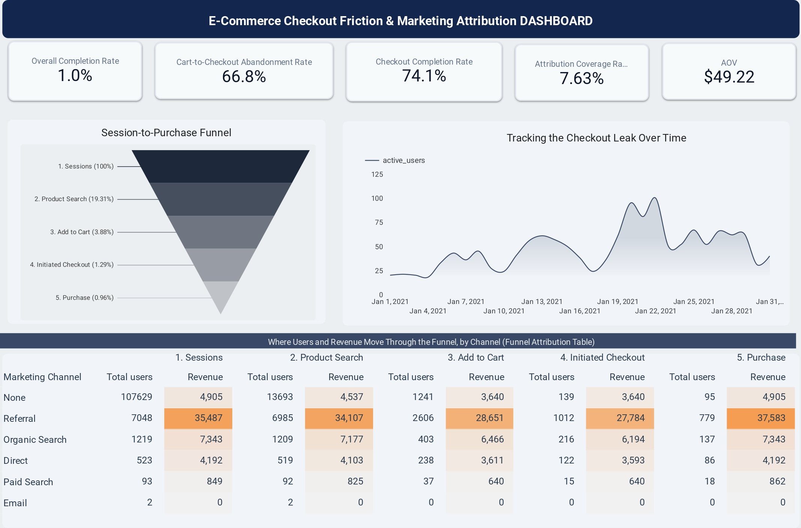

# E-Commerce Checkout Funnel Analysis

> Built an end-to-end SQL analytics pipeline in Google BigQuery using **116,000+ GA4 sessions** to identify checkout friction, measure conversion performance, and deliver an interactive Looker Studio dashboard with actionable business insights.

<p align="center">
  <a href="https://datastudio.google.com/reporting/03d92539-57f4-462f-a22a-b42da8674bfe">
    
  </a>
  <a href="https://medium.com/@gabrielblessing381/e-commerce-checkout-friction-marketing-attribution-738051b32d62?sharedUserId=gabrielblessing381">
    
  </a>
</p>



---

## Project Overview

Every online store loses customers during the buying journey. The challenge is identifying **where** they leave and **why**.

This project analyzes customer behavior across an e-commerce website to identify the biggest points of friction in the checkout funnel. Using an anonymized dataset of **116,000+ Google Analytics 4 (GA4) sessions** from Google's public BigQuery repository (`January 1–31, 2021`), I built an end-to-end SQL pipeline and an interactive Looker Studio dashboard to measure funnel performance and uncover opportunities to improve conversions.

The project helps Product, Growth, and Marketing teams make data-driven decisions that improve the customer experience and increase revenue.

---

## Skills Demonstrated

- SQL
- Google BigQuery
- Google Analytics 4 (GA4)
- Looker Studio
- Data Cleaning
- Data Transformation
- Funnel Analysis
- Customer Journey Analytics
- Data Validation
- Dashboard Development
- Business Intelligence
- Stakeholder Reporting

---

## Business Problem

Although customers are visiting the store and adding products to their carts, many abandon the purchase journey before starting checkout.

This project answers three business questions:

- Where do customers leave the conversion funnel?
- Which stage has the biggest impact on revenue?
- What improvements could increase conversions?

---

## Project Objectives

- Measure performance across each stage of the checkout funnel.
- Identify the largest customer drop-off points.
- Validate the quality of the underlying data.
- Build an interactive dashboard for business users.
- Recommend actions backed by data.

---

## Tools & Technologies

| Tool | Purpose |
|------|---------|
| **Google BigQuery** | Data warehouse |
| **SQL** | Data extraction, transformation, and analysis |
| **Looker Studio** | Dashboard and reporting |

---

## Technical Approach

This project was built using a modular SQL pipeline in **Google BigQuery**.

The workflow included:

- Cleaning and transforming raw GA4 event data.
- Creating reliable session-level records from event-level data.
- Measuring customer movement through each stage of the checkout funnel.
- Calculating conversion metrics and funnel performance.
- Preparing a reporting table optimized for Looker Studio.

The final dataset powers an interactive dashboard that helps stakeholders identify conversion bottlenecks and revenue opportunities.

👉 **SQL Pipeline:** [`/sql/funnel_attribution.sql`](./sql/funnel_attribution.sql)

---

## Executive Summary

| Metric | Result | Business Insight |
|--------|--------|------------------|
| **Overall Conversion Rate** | **0.96%** | Fewer than 1 in 100 sessions resulted in a purchase. |
| **Cart-to-Checkout Drop-off** | **66.8%** | The largest revenue opportunity. Most customers abandon before starting checkout. |
| **Checkout Completion Rate** | **74.1%** | Customers who begin checkout usually complete their purchase. |
| **Traffic with Marketing Attribution** | **8.0%** | Most sessions have missing attribution data, indicating a tracking issue that should be investigated. |

---

## Key Findings

The analysis shows that the **largest opportunity to improve revenue is before checkout begins**.

While many visitors leave early in the shopping journey, the highest-value drop-off occurs after customers have already shown buying intent by adding products to their cart.

Approximately **two-thirds of customers who add an item to their cart never begin checkout**, making this the highest-impact area for optimization.

The project also uncovered a major data quality issue: **92% of sessions were missing marketing attribution information**, limiting visibility into acquisition performance.

---

## Funnel Performance

| Journey Step | Sessions | % of Total Traffic | Conversion from Previous Step |
|--------------|----------|-------------------|------------------------------|
| Session Start | 116,514 | 100.0% | — |
| Product View | 22,500 | 19.31% | 19.31% |
| Add to Cart | 4,525 | 3.88% | 20.11% |
| Begin Checkout | 1,504 | 1.29% | 33.24% |
| Purchase | 1,115 | 0.96% | **74.14%** |

---

## Data Validation

To ensure the findings were reliable, I validated the results against several possible causes.

### Top-of-Funnel Drop-off

The large drop between **Session Start** and **Product View** was tested against duplicate events and funnel logic.

Neither explained the behavior, suggesting the traffic likely includes bots or very low-intent visitors rather than a reporting issue.

### Marketing Attribution Audit

The SQL output was compared against the original GA4 fields (`session_source` and `session_medium`).

The missing attribution already existed in the source data, confirming the issue originated during data collection rather than the SQL transformation.

### Funnel Anomaly

Approximately **6.7%** of referral purchases occurred without a recorded `view_item` event.

This suggests either:

- an alternative purchase journey, or
- delayed event tracking on specific landing pages.

---

## Recommendations

Based on the findings, I recommend the following actions:

1. **Investigate cart abandonment**

   Use session replay and error monitoring to identify usability issues, JavaScript errors, slow-loading elements, or unexpected friction on the cart page.

2. **Review event tracking**

   Audit Google Tag Manager implementation to ensure important events such as `view_item` are consistently captured.

3. **Investigate missing attribution**

   Review the tracking implementation responsible for capturing session source information before it reaches BigQuery.

---

## Repository Guide

### Data Source

Google Analytics 4 Public Sample Dataset

```text
bigquery-public-data.ga4_obfuscated_sample_ecommerce
```

### Run the Project

Execute the SQL script below in Google BigQuery.

```text
/sql/funnel_attribution.sql
```

Connect the resulting table to Looker Studio to recreate the dashboard.
